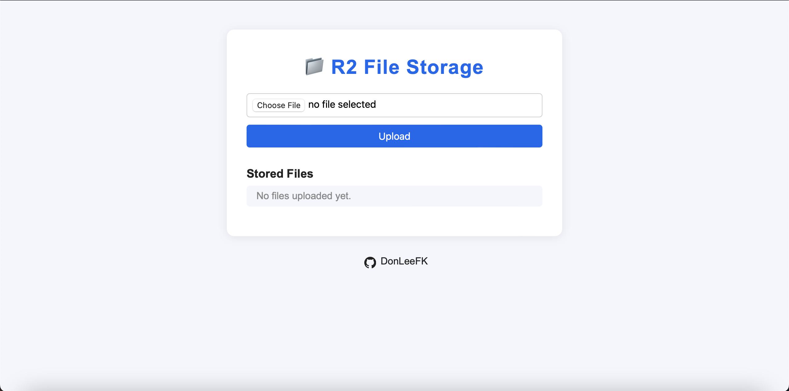

# R2 File Storage Interface

A Cloudflare Worker that provides a web interface for uploading and downloading files from Cloudflare R2 storage.

## Features

- Web interface for file management
- Upload files via browser
- List/download stored files
- Optional token-based authentication
- Responsive design

## Requirements

- Cloudflare account with Workers access
- R2 bucket configured
- (Optional) Token for access control

## Deployment

1. Clone this repository

## Usage

- Access the web interface at your worker URL
- Upload files using the form
- Download files by clicking their names
- If token is configured:
  - First access will prompt for token
  - Include token in upload requests

## Screenshots

